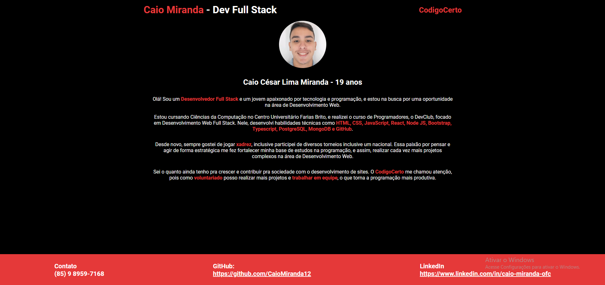
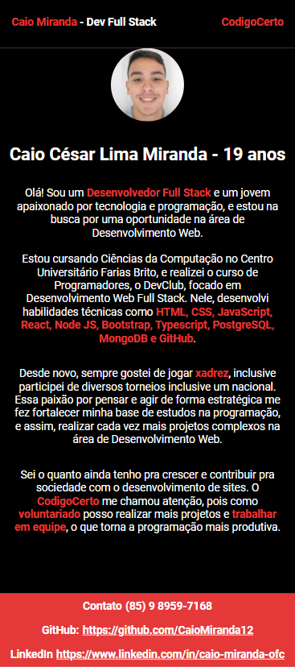

# 📚 Trilha Inicial Front-End Jr
Este projeto tem como objetivo criar uma página web onde os candidatos podem se apresentar, compartilhar seus gostos pessoais e explicar por que desejam fazer parte da comunidade **Codigo Certo Coders** e participar de projetos voluntários.

## Documentação do Projeto

## Apresentação de Caio - CodigoCerto

O projeto é uma breve apresentação sobre a minha pessoa e das minhas habilidades técnicas, em que no footer há links para Contato, GitHub e LinkedIn.
Além disso, possui uma estrutura responsiva tanto para Desktop quanto para Mobile.

Tecnologias: HTML e CSS

### Desktop:

### Mobile:

## Estrutura da Página
- **Foto:** Incluir uma foto pessoal.
- **Informações Pessoais:** Nome completo e idade.
- **Sobre:** Descrição pessoal, incluindo objetivos de carreira, áreas de interesse na programação, entre outros.
- **Gostos Pessoais:** Liste ou descreva seus gostos pessoais de uma maneira que mostre sua criatividade e paixões.
- **Motivações:** Explique sua motivação em querer participar da comunidade **Codigo Certo Coders**

**Como você pode contar sua história de maneira visual e envolvente?**
(Transmita a resposta dessas perguntas de alguma forma na sua página)

### Requisitos de Design e Funcionalidade 
- **Design Moderno e Responsivo:** Garantir que a página seja visualmente atraente e funcional em diferentes dispositivos.
- **Uso de Imagens:** Incluir pelo menos uma imagem (foto pessoal).

Primordial: Utilizar as cores da paleta da **Codigo Certo Coders:**

- **#000000** (preto)
- **#e53939** (vermelho)
- **#ffffff** (branco)

### Detalhes Técnicos: 🔧
- **Boas Práticas:** Utilizar boas práticas de código limpo, legível e bem documentado.
- **Git:** Utilizar Git para controle de versão e submeter o projeto através de um repositório público no GitHub.

### Apreciações: 🎉
- **Feedbacks visuais para o usuário.**
- **Permitir edição dos conteúdos.**
- **Utilização máxima possível de HTML semântico.**
- **CSS bem estruturado.**
- **Código limpo e bem organizado.**

### Dicas para Abordar o Projeto 🌟
- **Crie um Fork desse Repositório.**
- **Criar do Zero:** É fundamental que o projeto seja desenvolvido completamente do zero, demonstrando suas habilidades e criatividade desde o início.
- **Atenção aos Detalhes Visuais:** Utilize a paleta de cores e elementos visuais de forma coesa para uma experiência impactante.
- **Versionamento com Git:** Faça uso eficiente do Git para controlar suas alterações e manter um histórico claro do desenvolvimento.

### Critérios de Avaliação: 📝
- **Funcionalidade:** A aplicação deve atender à estrutura da página e aos requisitos definidos.
- **Qualidade do Código:** O código deve ser limpo, bem estruturado e adequadamente documentado.
- **UI/UX:** A interface do usuário deve ser intuitiva e visualmente atraente.
- **Uso do Git:** Utilização eficaz do controle de versão com mensagens de commit significativas.

### Não Queremos 🚫
- Descobrir que o candidato não foi quem realizou o teste.
- Ver commits grandes sem muita explicação nas mensagens no repositório.
- Entregas padrão ou cópias de outros projetos. Buscamos originalidade e autenticidade em cada contribuição.

### Prazo ⏳
A data máxima para entrega das trilhas foi removida, permitindo que as pessoas entreguem conforme sua disponibilidade. No entanto, ainda é necessário concluir a trilha com sucesso para ser inserido em uma equipe.

### Instruções de Entrega: 📬
Após finalizar o projeto, publique-o em uma URL pública (por exemplo, Vercel, Netlify, GitHub Pages, etc.) e preencha o [Formulário](https://forms.gle/gZViPMTSDV5nidSu6):  

---

### Desafio da Inovação 🚀
Achou esse projeto inicial simples? Eleve ainda mais! Estamos em busca de mentes inovadoras que não apenas criem, mas que também desafiem os padrões. Como você pode transformar essa estrutura inicial em algo verdadeiramente extraordinário? Demonstre o poder da sua criatividade e o impacto das suas ideias inovadoras!

---

🔗 **Mantenha-se Conectado:**
- [Discord](https://discord.gg/wzA9FGZHNv)
- [Website](http://www.codigocertocoders.com.br/)
- [LinkedIn](https://www.linkedin.com/company/codigocerto/)
  
🌐 **Contato:**
- Email: codigocertocoders@gmail.com

---

### Precisa de Ajuda?
Está com alguma dificuldade, encontrou algum problema no desafio ou tem alguma sugestão pra gente? Crie uma issue e descreva o que achar necessário.

**Construindo o amanhã, hoje.**
